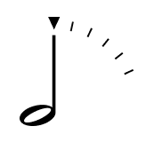

# Octave Timer for Windows

A version of [Octave Timer](https://github.com/DawnPaladin/octave-timer) that runs on Windows. I still use this, but Microsoft has since raised the feature threshold required to get into the Windows store, so it's no longer distributed there.
